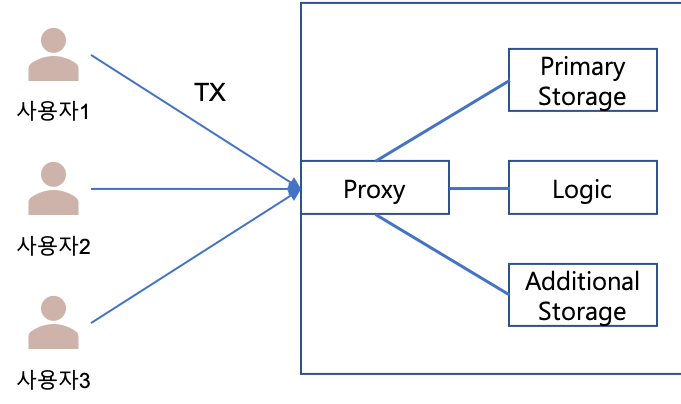

DCToken
=============
### 1. 주요 기능
* 실물 화폐(KRW)가 담보 된 디지털 화폐를 ERC-20 Token을 기반으로 작성
* Openzeppelin Solidity Library의 AccessControl 을 이용하여 특정 권한(발행 / 소각 / 운영) 생성.
* 다수의 계정에 하나의 특정 권한 부여, 하나의 특정 권한을 다수의 계정에게 부여 가능
* 실물 화폐(KRW)가 담보 되어 있음은 발행 권한을 갖는 계정이 보증해야 함
* DC 화폐 소각 시 상응하는 실물 화폐(KRW)가 지급 됨은 소각 권한을 갖는 계정이 보증해야 함
* DC Token은 크게 Proxy, DataStorage, Logic 부로 구분되어 구현 되어 있음

### 2. 권한의 종류
* Operator
    * DC Token을 운영하기 위한 Adminitor 역할을 수행
    * DC Token 긴급 동작 정지(pause) 실행 권한을 가짐
    * Logic 컨트랙트 설계/버전 관리 권한을 가짐
    * 신규 권한 정의 및 권한 부여의 권한을 가짐
    * Data Storage 생성 및 관리 권한을 가짐
    * Proxy와 연결 된 Logic 및 Data Storage 컨트랙트를 연결 해지 및 업데이트를 할 수 있으며, 정상 적인 DC Token 운영을 보증해야 함
* Minter
    * DC Token 을 특정 계정에게 발행 해 줄 수 있는 권한을 가짐
    * DC Token 의 지급 보증이 되는 실물 화폐(KRW)가 담보 되어 있음을 본 권한을 가진 계정이 보증해야 함
* Burner
    * 특정 계정가 보유한 DC Token 을 소각(Burn) 할 수 있는 권한을 가짐
    * DC Token을 소각하여 이에 상응하는 실물 화폐(KRW)가 DC Token을 보유 했었던 계정에 지급 됨을 본 권한을 가진 계정이 보증해야 함

### 3. 호출 가능한 함수 목록
* AccessControl 관련 함수 (Role management)
    * hasRole(bytes32 role, address account) returns (bool)
        * account가 role 권한 보유 여부를 확인
    * getRoleMemberCount(bytes32 role) returns (uint256)
        * role 권한을 보유한 계정의 갯수 확인
    * getRoleMember(bytes32 role, uint256 index) returns (address)
        * role 권한을 가진 계정 리스트에서 index 에 해당하는 계정의 주소를 리턴
    * getRoleAdmin(bytes32 role) returns (address)
        * role 권한을 부여 / 회수 할 수 있는 권한을 가진 admin 계정의 주소를 리턴
    * grantRole(bytes32 role, address account)
        * 특정 계정에게 role 의 권한을 부여
        * role 의 권한 부여 자격이 있는 admin 계정만 사용 가능
    * revokeRole(bytes32 role, address account)
        * 특정 계정에게 부여된 role의 권한을 회수 할 때 사용
    * renounceRole(bytes32 role, address account)
        * role의 권한을 가진 특정 account가 부여 받은 role을 스스로 반납 할 때 사용
* DC Token 운영과 관계된 함수 (Operator 권한 필요)
    * setInitialize(address minter, address burner)
        * 초기 minter와 burner 타입의 권한을 부여함
    * addDataStorage(address storageContract)
        * Proxy 컨트랙트에 연결할 DataStorage 컨트랙트를 추가함
        * Proxy 컨트랙트에는 다수의 DataStorage 컨트랙트를 연결하기 위해 가변 배열 형태로 DataStorage를 관리함
    * updateDataStorage(uint256 index, address storageContract)
        * Proxy 컨트랙트 내부에 DataStorage 컨트랙트를 관리하는 가변 배열의 특정 위치(index)의 DataStorage를 업데이트 할 때 사용
    * updateLogicContract(address logicContract)
        * Proxy 컨트랙트에 연결 된 Logic 컨드랙트(ERC20 전송 로직 구현부)를 업데이트 할 때 사용
    * transferStorageOwnership(uint256 index, address target)
        * Data Storage 컨트랙트는 특정 계정만이 내부의 Data를 업데이트 할 수 있도록 Ownership 기반의 update 함수로 구현되어 있음
        * 운영간 저장 된 내부 data 강제 업데이트가 필요한 상황을 대비하여 ownership을 proxy에서 다른 계정으로의 반환에 사용하기 위해 만들어진 함수
    * pause()
        * 토큰의 발행, 소각, 전송 기능을 강제 중지 시킴
        * Operator 권한을 부여받은 계정에서만 호출 가능
    * unpause()
        * 정지된 토큰의 발행, 소각, 전송 기능을 활성화 시킴
        * Operator 권한을 부여받은 계정에서만 호출 가능
* DC Token 발행과 관계된 함수 (Minter 권한 필요)
    * issue(address tokenHolder, uint256 value)
        * 특정 계정(tokenHolder)에게 value만큼의 토큰을 발행
        * mint 권한을 부여 받은 계정에서만 호출 가능함
* DC Token 소각과 관계된 함수 (Burner 권한 필요)
    * redeem(address tokenHolder, uint256 value)
        * 특정 계정(tokenHolder)가 보유한 토큰 중 value 만큼의 토큰을 소각
        * burner 권한을 부여 받은 계정에서만 호출 가능함
* 범용적으로 호출되는 함수
    * EIP20 관련 함수(참고 : [EIP20](https://eips.ethereum.org/EIPS/eip-20))
        * name() returns (string)
            * 토큰의 명칭 조회 (Digital Currency)
        * symbol() returns (string)
            * 토큰의 심볼 조회 (KRW)
        * decimals() returns (uint8)
            * 토큰의 소수점 단위 (0)
        * totalSupply() returns (uint256)
            * 토큰의 총 발행량
        * balanceOf(address account) returns (uint256)
            * 특정 계정의 토큰 보유량 조회
        * transfer(address recipient, uint256 amount)
            * 호출한 계정이 보유한 토큰에서 amount 만큼 recipient 계정에게 전송함
        * allowance(address owner, address spender) returns (uint256)
            * owner 계정에서 spender에게 인출 허용량을 조회
        * approve(address spender, uint256 amount)
            * 호출한 계정이 spender 계정에게 amount 만큼의 토큰 인출을 허용하고자 할 때 사용
        * transferFrom(address spender, address recipient, uint256 amount)
            * spender 계정에서 호출한 계정이 amount 만큼의 금액을 recipent에게 전송시 사용
            * spender 계정에서 호출한 계정에게 허용(approve)한 금액 범위 내에서 전송이 가능함
        * increaseAllowance(address spender, uint256 addedValue)
            * 호출한 계정이 spender에게 허용(approve)한 금액을 증가 시키고자 할 경우에 사용
            * 증액을 위해 approve 를 호출 할 경우, 이중으로 transferFrom 호출이 발생 하는 상황이 발생 할 수 있으며, 이를 방지하기 위해 사용
        * decreaseAllowance(address spender, uint256 subtractedValue)
            * 호출한 계정이 spender에게 허용(approve)한 금액을 감소시키고자 할 경우에 사용
            * 감액을 위해 approve 를 호출 할 경우, 이중으로 transferFrom 호출이 발생 하는 상황이 발생 할 수 있으며, 이를 방지하기 위해 사용
    * EIP2612 관련 함수(참고 : [EIP2612](https://eips.ethereum.org/EIPS/eip-2612))
        * nonces(address owner)
            * permit에 제출하는 signature 생성 시 사용되는 nonce 값 조회시 사용
            * signature 재사용 방지를 위해 사용됨
        * permit(address owner, address spender, uint256 value, uint256 deadline, uint8 v, bytes32 r, bytes32 s)
            * owner 계정에서 생성한 signature를 제출하여 implicit approve 처리
            * signature v,r,s 생성과정
                1. nonce 조회
                2. deadline 설정
                3. Domain Separator 생성 
                    

 
                4. message digest 생성 
                    

 
                    

 
                5. owner 계정의 private key로 message digest를 서명